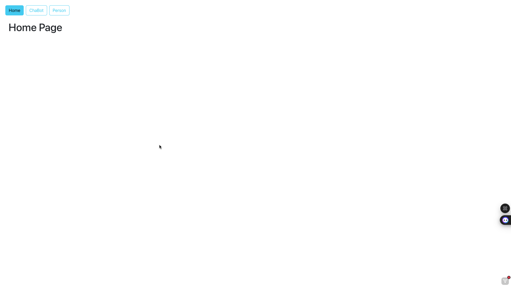
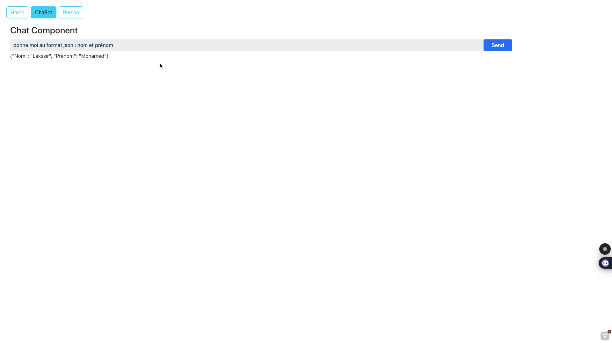
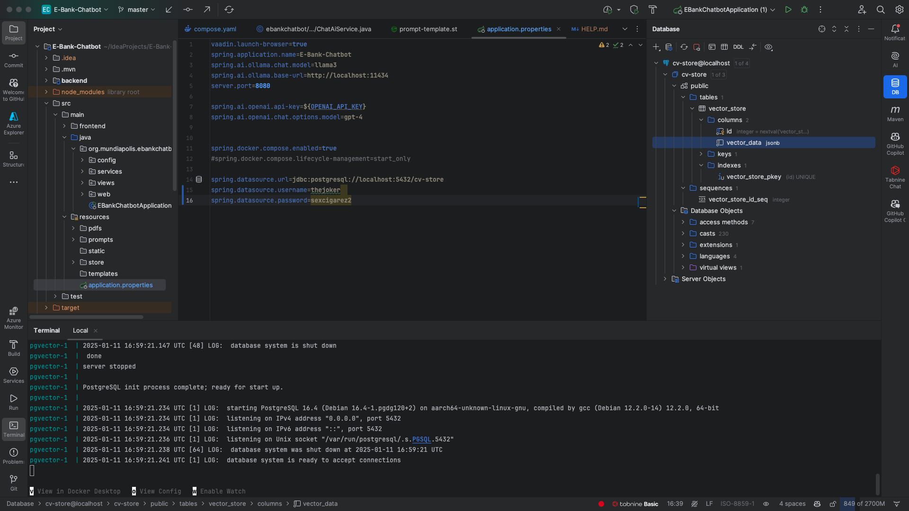
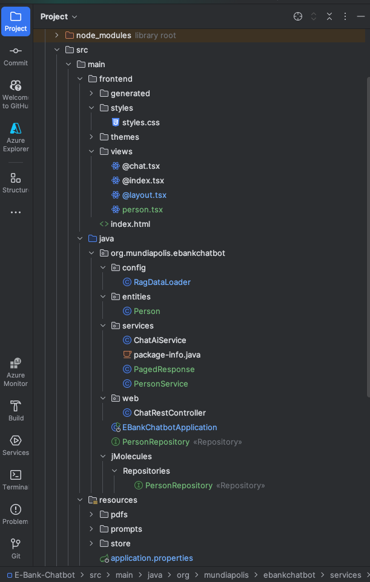
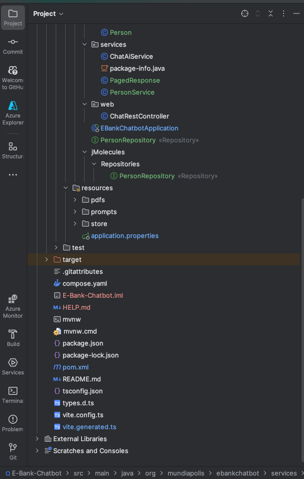

# E-Bank

## Overview

E-Bank is a comprehensive banking management application designed to handle customers, accounts, operations, and facilitate interactions through an intelligent chatbot. It consists of two main parts:
1. Backend: Built using Spring Boot.
2. Frontend: Developed using Angular for the banking interface and React with Vite for the chatbot.

## Features

### Backend
- Manage customers and bank accounts.
- Perform debit, credit, and transfer operations.
- Support for saving and current accounts.
- AI services for managing chatbot interactions.
- Data management with JSON files and dynamic loading.
- Integration with MySQL database.
- Secure API endpoints with Spring Security and JWT.

### Frontend
- User authentication and authorization.
- Customer and account management interface.
- Interactive dashboard with charts for key banking metrics (using Chart.js).
- Views and components to manage the chatbot interface.
- Automatic generation of TypeScript files from backend endpoints.
- Responsive design for multiple devices.

## Technologies Used

### Backend
- Java
- Spring Boot
- Hibernate
- Maven

### Frontend
- Angular
- Chart.js
- TypeScript
- Vite
- React

### Security
- Spring Security
- JWT

### Miscellaneous Tools
- Docker and Docker Compose
- IntelliJ IDEA for development

## Project Structure

The project is organized into two main parts:
1. E-Bank (Banking Interface):
   - **Backend**: Spring Boot services for managing customers, accounts, and operations.
   - **Frontend**: Angular-based responsive banking interface.
2. E-Bank Chatbot:
   - **Backend**: Java Spring Boot with AI services.
   - **Frontend**: React with Vite for chatbot interface.
   - Persistent data storage in JSON files.

## How to Start the Project

### E-Bank (Banking Interface)
1. Clone the repository:
```bash
git clone https://github.com/ayman-gassi/E-Bank.git
git clone https://github.com/thejokers69/E-Bank.git (forked)
cd E-Bank
```

2. Build the backend:
```bash
cd backend
./mvnw clean install
./mvnw spring-boot:run
```

3. Start the frontend:
```bash
cd frontend
npm install
npm start
```

### E-Bank Chatbot
1. Clone the repository:
```bash
git clone https://github.com/thejokers69/E-Bank-Chatbot.git
cd E-Bank-Chatbot
```

2. Build the backend:
```bash
cd backend
./mvnw clean install
./mvnw spring-boot:run
```

3. Start the chatbot frontend:
```bash
cd src/main/frontend
npm install
npm run dev
```

4. Launch via Docker Compose (optional):
```bash
docker-compose up
```

## Database Configuration

### Banking Interface

The banking interface uses a MySQL database. Ensure you have MySQL installed and running. Update the application.properties file accordingly.

### Chatbot

To set up the PostgreSQL database for the chatbot:
1. Run Docker Compose:
```bash
docker-compose up -d
```

2. Access the database container:
```bash
docker ps
docker exec -i <container_id> psql -U admin -d cv_store
```

3. Execute the following commands in PostgreSQL:
```sql
CREATE EXTENSION IF NOT EXISTS vector;
CREATE EXTENSION IF NOT EXISTS hstore;
CREATE EXTENSION IF NOT EXISTS "uuid-ossp";

CREATE TABLE IF NOT EXISTS vector_store (
    id uuid DEFAULT uuid_generate_v4() PRIMARY KEY,
    content text,
    metadata json,
    embedding vector(1536) -- 1536 is the default embedding dimension
);

CREATE INDEX ON vector_store USING HNSW (embedding vector_cosine_ops);
```

4. Set up the database manually:
```bash
psql -U your-username
```

5. Create a database:
```sql
CREATE DATABASE cv_store;
```

6. Create a user and grant permissions:
```sql
CREATE USER admin WITH PASSWORD 'password';
GRANT ALL PRIVILEGES ON DATABASE cv_store TO admin;
```

7. Update the application.properties file:
```properties
spring.datasource.url=jdbc:postgresql://localhost:5432/cv_store
spring.datasource.username=admin
spring.datasource.password=password
spring.jpa.hibernate.ddl-auto=update
```

## Screenshots

### Banking Interface
- Dashboard

### Chatbot Interface
- Home Page
- Chatbot Page
- Database Screenshot

## Contributing

Please read the [CONTRIBUTING.md](CONTRIBUTING.md) for details on our code of conduct and the process for submitting pull requests.

## License

This project is licensed under the MIT License - see the [LICENSE.md](LICENSE.md) file for details.

## Author
- Banking Interface: Ayman Gassi
- Chatbot: Mohamed Lakssir

## E-Bank Chatbot

E-Bank Chatbot is a project aimed at developing a web application to facilitate interactions with a virtual bank via an intelligent chatbot. This project combines a Java backend with Spring Boot and a React frontend with Vite.

## Table of Contents
- [Project Structure](#project-structure)
- [Main Content](#main-content)
  - [Backend](#backend)
  - [Frontend](#frontend)
- [Important Files and Folders](#important-files-and-folders)
- [Screenshots](#screenshots)
- [Commands Used](#commands-used)
  - [Git Initialization](#git-initialization)
- [Technologies Used](#technologies-used)
- [How to Start the Project](#how-to-start-the-project)
- [Prerequisites](#prerequisites)
- [Database Configuration](#database-configuration)
- [Contributing](#contributing)
- [License](#license)
- [Author](#author)

## Project Structure

The project is organized into two main parts:
- **Backend**: Developed in Java with Spring Boot, it contains the main services, REST controllers, and necessary configurations.
- **Frontend**: Built with TypeScript, Vite, and React, it provides an interactive and responsive user interface.

## Main Content

### Backend
- AI services for managing chatbot interactions.
- Data management with JSON files and dynamic loading.
- REST API for communication with the frontend.

### Frontend
- Automatic generation of TypeScript files from backend endpoints.
- Views and components to manage the user interface.
- Integration with the backend via generated files.

## Important Files and Folders

- `compose.yaml`: Docker Compose configuration file.
- `pom.xml`: Maven configuration for the Java project.
- `package.json`: Frontend dependency management.
- `application.properties`: Spring Boot properties configuration.
- `prompts/`: Prompt templates for chatbot AI management.
- `store/`: Persistent data storage in JSON files.

## Screenshots
### Home Page 


### Chatbot Page


### Database Screenshot


### Project Tree 



## Commands Used

### Git Initialization
```bash
git init
git remote add origin https://github.com/thejokers69/E-Bank-Chatbot.git
git add .
git commit -m "Initial commit for E-Bank-Chatbot"
git push -f origin master
```

## Technologies Used
### Backend
- Java
- Spring Boot
- Maven

### Frontend
- TypeScript
- Vite
- React

### Miscellaneous Tools
- Docker and Docker Compose
- IntelliJ IDEA for development

## How to Start the Project

1. Clone the repository:
```bash
git clone https://github.com/thejokers69/E-Bank-Chatbot.git
cd E-Bank-Chatbot
```

2. Build the backend:
```bash
cd backend
./mvnw clean install
./mvnw spring-boot:run
```

3. Start the frontend:
```bash
cd src/main/frontend
npm install
npm run dev
```

4. Launch via Docker Compose (optional):
```bash
docker-compose up
```

## Prerequisites
- Java 11 or higher
- Node.js 14 or higher
- Docker (optional)

## Database Configuration

To set up the PostgreSQL database for the E-Bank Chatbot project, follow these steps:

### Prerequisites
- Ensure you have PostgreSQL installed and running on your system.
- Have access to a PostgreSQL client (e.g., psql CLI or a GUI tool like pgAdmin).

### Instructions to Create the Database
1. Login to PostgreSQL:
Use your PostgreSQL user account to log in. Replace your-username with your PostgreSQL username:
```bash
psql -U your-username
```

2. Create a Database:
Run the following command to create a new database for the project:
```sql
CREATE DATABASE cv_store;
```

3. Create a User:
Create a new PostgreSQL user with a password. Replace thejoker with the desired username and sexcigarez2 with a secure password:
```sql
CREATE USER admin WITH PASSWORD 'password';
```

4. Grant Permissions:
Grant all privileges on the database to the created user:
```sql
GRANT ALL PRIVILEGES ON DATABASE cv_store TO admin;
```

5. Connect to the Database:
Use the following command to switch to the newly created database:
```bash
\c cv_store
```

6. Create Tables (Optional):
If you need to manually create the tables (e.g., Person table), use SQL scripts similar to the following:
```sql
CREATE TABLE person (
    id SERIAL PRIMARY KEY,
    name VARCHAR(100) NOT NULL,
    email VARCHAR(255) NOT NULL UNIQUE
);
```

### Updating application.properties

Ensure the application.properties file in the project is correctly configured to connect to your PostgreSQL database. Here’s an example configuration:
```properties
spring.datasource.url=jdbc:postgresql://localhost:5432/cv_store
spring.datasource.username=admin
spring.datasource.password=password
spring.jpa.hibernate.ddl-auto=update
spring.jpa.properties.hibernate.dialect=org.hibernate.dialect.PostgreSQLDialect
spring.jpa.show-sql=true
spring.jpa.properties.hibernate.format_sql=true
logging.level.org.hibernate.SQL=DEBUG
logging.level.org.hibernate.type.descriptor.sql.BasicBinder=TRACE
```

### Testing the Connection

Once the database is set up and the application properties are updated, test the connection by running the backend service:
```bash
./mvnw spring-boot:run
```

If the connection is successful, the application will automatically initialize the required tables and data as per the Person entity configuration.

## Contributing
Please read the [CONTRIBUTING.md](CONTRIBUTING.md) for details on our code of conduct, and the process for submitting pull requests.

## License
This project is licensed under the MIT License - see the [LICENSE.md](LICENSE.md) file for details.

## Author
Mohamed Lakssir 2ACI Info

